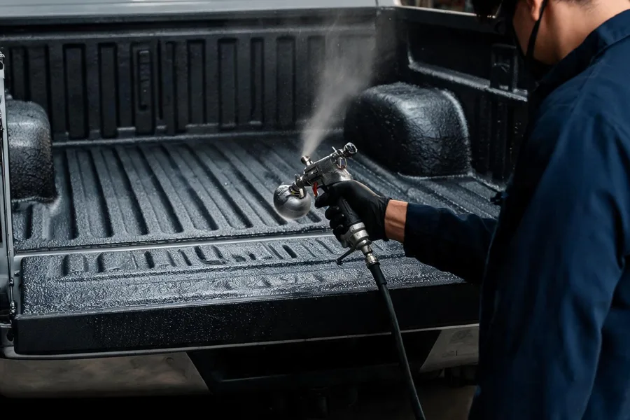

# Service Cart Lite — UI/UX & Conversion Retrofit

Surgical retrofit of the existing static site. No architecture, typography,
color, hero, funnel, CMS, lead API, or attribution behavior was changed. All
work is additive except the homepage card backgrounds and the removal of one
redundant navigation link.

Branch: `feat/service-cart-lite`

---

## 1. Homepage service-card photography

The six featured homepage service cards previously used CSS gradient
placeholders (`<div class="service-card-grad svc-bg-*">`). Each is now a real
photo using the pre-existing (previously unused) `.service-card-img` CSS class,
which already defines `object-fit: cover`, the brightness filter, and the hover
zoom — so overlay, card copy, hover behavior, layout, and links are unchanged.

- Source PNGs from `generated_assets/capital-upfitters-services/` were converted
  to web-optimized WebP (900×600, quality 82, ~38–64 KB each, 308 KB total) with
  ImageMagick and committed to **`assets/services/`**:
  `bedliner.webp`, `tonneau.webp`, `running-boards.webp`, `ceramic-coating.webp`,
  `undercoating.webp`, `hitches.webp`.
- Markup pattern (decorative image; the `<a>` already carries `aria-label`, so
  `alt=""` is correct and avoids duplicate announcements):
  ```html
  
  ```

### Replacing the images later (Tina / backend)
There is **no existing homepage-card image field** in `cms-data.json` or the Tina
schema (services have a `hero` block but no card image), so no CMS migration was
invented. Two clean, documented paths to swap images:

1. **Drop-in file replace (simplest):** overwrite the file at
   `assets/services/<slug>.webp` — the path is derived from the
   `data-service-image="<slug>"` attribute on each card, so slugs are the stable
   contract.
2. **Wire to Tina (future):** add a `cardImage` image field to the `services`
   collection, then point each card's `src` at the CMS media URL. The
   `data-service-image` slug already matches each service's `slug`, so a build
   step / template can map `service.cardImage` → the matching card with no markup
   restructure.

The now-unused `.svc-bg-*` / `.service-card-grad` gradient rules were left in
`index.html` intentionally as a zero-risk rollback path (see Rollback).

---

## 2. Lightweight multi-service quote cart — `cart.js`

New single shared file **`cart.js`**, included on every shared page right after
`/lead-form.js` (root-absolute `<script src="/cart.js" defer>`, matching the
existing `attribution.js` / `lead-form.js` convention). Injected mechanically
into all 31 pages, so no per-page hand-editing of the badge.

**Storage:** `localStorage` under the versioned key
`capitalUpfitters.quoteCart.v1`.

**Item schema:** `{ slug: string, name: string }`, deduplicated by `slug`.
Reads are defensively parsed (bad/legacy JSON → empty cart).

**Single global namespace** `window.CUQuoteCart`:

| Method | Purpose |
|---|---|
| `add(slug, name)` | add (deduped); `name` optional, falls back to the registry |
| `remove(slug)` | remove by slug |
| `toggle(slug, name)` | add if absent / remove if present; returns `true` if added |
| `has(slug)` | membership test |
| `get()` | array of `{slug, name}` |
| `clear()` | empty the cart |
| `count()` | item count |
| `buildQuoteUrl()` | relative `quote.html` URL with `?service=a,b,c` |
| `slugForValue(value)` | reverse map a checkbox value → slug |
| `services` | the slug → `{name, match}` registry (single source of truth) |
| `onChange(fn)` | subscribe; returns an unsubscribe fn |

Changes also emit a `cu-quote-cart-change` `CustomEvent` on `window` and are
picked up cross-tab via the `storage` event.

**Floating quote badge** (injected by `cart.js`, not hand-added):
- Fixed **bottom-left** (the existing "Get a Quote" float CTA is bottom-right, so
  no overlap); drops to a smaller offset ≤480px so it clears mobile controls.
- Hidden when empty; shows `Quote (N)` when populated.
- It is an `<a>` (keyboard focusable, `:focus-visible` ring, `aria-live="polite"`,
  descriptive `aria-label`). Clicking opens `quote.html`.
- Relative URL resolution: `buildQuoteUrl()` returns `../quote.html` on
  `/services/` and `/locations/` pages and `quote.html` at the root — verified
  from all three depths.

---

## 3. Add-to-Quote on service pages

A compact secondary CTA sits next to the primary hero CTA on **all 16 real
service-detail pages** (the `/services/` hub `index.html` is excluded).

Scalable pattern — semantic data attribute + shared init in `cart.js`; no
per-page logic:
```html
<button type="button" class="btn btn-outline btn-lg btn-add-quote"
        data-add-to-quote="bedliner">
  <span class="btn-add-quote-plus">Add to Quote</span>
  <span class="btn-add-quote-check">Added to Quote</span>
</button>
```
`cart.js` finds every `[data-add-to-quote]`, wires the click to
`CUQuoteCart.toggle(slug)`, and reflects state via `data-in-cart` (CSS swaps the
label to **"Added to Quote"** with a filled style). Toggling inherently prevents
duplicate cart items. Existing `Get a Quote` links/forms are untouched.

14 pages share the standard `.hero-ctas` block (scripted insert). Two outliers
were edited individually: `commercial-wraps.html` (hero CTA block has extra
`reveal` classes) and `stealth-hitches.html` (uses its bespoke `sh-btn-*` hero
buttons — the button reuses `sh-btn-outline` for visual fit plus `btn-add-quote`
for state).

Slugs match each page's existing `?service=` hero-CTA value
(`stealth-hitches.html` → `stealth-hitch`).

---

## 4. Cart-aware quote form (`quote.html`)

The segmented audience tabs, form design, fields, endpoint, and payload are
unchanged. Added an integration script (runs on `DOMContentLoaded`, after the
deferred `cart.js` has defined `CUQuoteCart`):

- **Merge on load:** reads `?service=` supporting **comma-separated values and
  repeated params**, merges those slugs with the localStorage cart.
- **Pre-selection:** checks the matching service checkboxes via a single mapping
  object (the `CUQuoteCart.services` registry — slug → checkbox `value`), across
  all panels. The prior fuzzy substring matcher was removed to avoid conflicts.
- **"Your quote request" summary:** a compact chip list injected near the top of
  the form (below the tabs). Each chip has an accessible remove button; removing
  updates the cart → which updates checkboxes, the floating badge, the chips, and
  the URL query.
- **Two-way sync:** editing a service checkbox flows back into the cart
  (`change` → `slugForValue` → add/remove). Fleet/dealer-only checkboxes that
  aren't in the cart registry are left alone.
- **URL/state:** `history.replaceState` keeps `?service=…` in sync (shareable,
  refresh-safe).
- **Submit:** each of the three forms clears the cart on `submit`. This matches
  the page's existing optimistic success UI and does **not** touch `lead-form.js`
  delivery or the payload (services still submit via the untouched
  `name="services"` checkboxes).

### Slug ↔ checkbox mapping
| slug | display name | checkbox value |
|---|---|---|
| bedliner | Spray-On Bedliners | Bedliner |
| tonneau | Tonneau Covers | Tonneau Cover |
| running-boards | Running Boards & Steps | Running Boards |
| ceramic-coating | Ceramic Coating & PPF | Ceramic Coating |
| undercoating | Undercoating & Rust Protection | Undercoating |
| hitches | Hitches & Towing | Hitches & Towing |
| camper-shells | Camper Shells & Caps | Camper Shell |
| commercial-wraps | Commercial Wraps | Commercial Wraps |
| exterior | Exterior Accessories | Exterior Accessories |
| industrial-coatings | Industrial & Protective Coatings | Industrial Coatings |
| lighting | LED Lighting | LED Lighting |
| mobile-detailing | Mobile Detailing | Mobile Detailing |
| stealth-hitch | Stealth Hitch — Luxury & EV | Hitches & Towing |
| suspension | Suspension, Lifts & Wheels | Suspension / Lift Kit |
| toolboxes | Toolboxes & Storage | Toolbox / Bed Storage |
| window-tinting | Window Tinting | Window Tinting |

---

## 5. Navigation simplification

Removed the redundant **top-level** `Industrial` link from both the desktop nav
(`<li>` wrapping `a.nav-industrial-link`) and the mobile menu
(`a.nav-mobile-direct` → industrial-coatings) across **all 31 pages** via a safe
scripted regex edit that is relative-path agnostic. Verified **zero** stale
top-level Industrial entries remain. `Industrial & Protective Coatings` inside
the Fleet & Business mega-dropdown and in-page links were retained. No other nav
reorder/redesign.

---

## Files changed

- **New:** `cart.js`, `assets/services/{bedliner,tonneau,running-boards,ceramic-coating,undercoating,hitches}.webp`, `SERVICE_CART_RETROFIT_REPORT.md`
- **`index.html`:** 6 service-card gradient divs → ``; `/cart.js` include; Industrial nav removal.
- **`style.css`:** appended badge / Add-to-Quote / summary-chip styles.
- **`quote.html`:** summary container; cart integration script; removed old fuzzy `?service=` matcher; `/cart.js` include; Industrial nav removal.
- **16 service pages** (`services/*.html` except `index.html`): Add-to-Quote button; `/cart.js` include; Industrial nav removal.
- **All other shared pages** (`404, contact, dealer-government, fleet, gallery, preview, privacy, rebates, start-here, services/index`, 4 `locations/*`): `/cart.js` include + Industrial nav removal only.

---

## QA performed

Tooling: `node --check` on all JS (standalone files + every inline block in
`index.html`/`quote.html`), and Playwright (Chromium) against a local
`python3 -m http.server`.

Automated checks — **31/31 + 4/4 passed**:
- Add from bedliner page → button flips to in-cart, count 1, badge shows `1`.
- Add from a 2nd page (tonneau); repeated toggles dedupe to count 2.
- Persistence across refresh; button reflects persisted state.
- Quote page: summary + 2 chips, correct checkboxes pre-checked.
- Remove chip → count/checkbox/summary update.
- Checkbox → cart sync (checking Ceramic adds the slug).
- Direct `?service=bedliner,tonneau` → 2 chips/2 cart items.
- Repeated + comma params (`?service=bedliner&service=bedliner,hitches`) dedupe to 2.
- Empty cart → badge hidden; homepage images load (`naturalWidth > 0`).
- Audience tabs still switch panels.
- No top-level `Industrial` nav link; mega-dropdown entry retained.
- Badge resolves `../quote.html` from `/services/` and `/locations/`, `quote.html` at root.

**Console errors:** the only errors observed are pre-existing cross-origin
failures from the site's own CMS hydration (`/api/public/services|faqs|settings`
on the live Vercel origin), which fail under a localhost origin. None originate
from `cart.js` or the quote integration.

---

## Known limitations

- Local testing cannot exercise the real `/api/lead` endpoint or CMS API (CORS
  on localhost); lead submission was verified structurally (payload/fields
  untouched), not end-to-end against production.
- `hitches` and `stealth-hitch` both map to the single "Hitches & Towing"
  checkbox. If both are added, the shared checkbox is checked; unchecking it maps
  back to `hitches` only, so a `stealth-hitch`-only selection can't be removed via
  that checkbox (remove it via its chip instead). Rare combination; low impact.
- Cart holds only registry (consumer) services; fleet/dealer-only checkboxes are
  intentionally not cart-tracked.

## Rollback

- Remove `<script src="/cart.js" defer></script>` (or delete `cart.js`) → badge,
  Add-to-Quote buttons, and quote pre-fill all no-op cleanly; forms/leads
  unaffected.
- Homepage photos: revert the 6 `` lines to the original
  `<div class="service-card-grad svc-bg-*">` — the gradient CSS is still present.
- Nav change and quote summary container are plain HTML reverts.

## Recommended next step

Add a `cardImage` field to the Tina `services` collection and a tiny build step
that stamps each homepage card `src`/`data-service-image` from the CMS, making
the six photos editable by non-developers — the slug contract is already in
place.

---

## Post-QA markup & wordmark fixes

Visual QA surfaced two pre-existing bugs (not introduced by the cart work),
fixed on this branch:

1. **Stray `>` / malformed `<head>` markup.** Two classes of invalid markup that
   leaked stray text into the rendered page:
   - `og:url` meta tags ended with a doubled `">>`, dropping a literal `>` into
     the layout. Fixed across **13 files**: `index.html`, `start-here.html`,
     `services/{bedliner,ceramic-coating,commercial-wraps,hitches,index,running-boards,tonneau,undercoating}.html`,
     `locations/{rockville,bethesda,silver-spring,gaithersburg}-md.html`.
   - Three `meta name="description"` tags had a prematurely-closed `content="…"`
     quote followed by leftover duplicate copy, spilling text into the DOM. Fixed
     in `index.html`, `start-here.html`, `locations/rockville-md.html` (kept the
     first complete sentence, dropped the garbled tail).
   - Verified zero `">>` and zero `content="…"<char>` patterns remain in any HTML.

2. **Header wordmark spacing.** The nav wordmark markup is
   `Capital<span>Upfitters</span>` with no separator, so it read as
   `CAPITALUPFITTERS`. Added `margin-left: 0.28em` to `.nav-logo-text span` in
   `style.css` — a single focused rule that separates the two-tone wordmark on
   every page, desktop and mobile, with no markup or design change. (The
   accent-colored `<span>` already visually distinguishes "Upfitters".)

**QA:** desktop (1280px) + mobile (390px) Playwright screenshots confirm the
stray `>` is gone (body now begins with the announcement-bar text) and the
wordmark renders as `CAPITAL UPFITTERS` with a clean gap. No stray `>` text
nodes in the DOM.

These fixes are mirrored into the preview build
(`/home/user/workspace/CapitalUpfittersWeb-preview`); the preview still contains
none of the iframe-forbidden API tokens (`localStorage`, `sessionStorage`,
`indexedDB`, pointer-lock, fullscreen).

---

## Post-QA hero stats containment

The homepage hero stats block (`30+ Years`, `5,000+ Vehicles`, `5.0★ Google`,
`150+ Brands`) was `position: absolute; right: 0` anchored to the **full-width**
`.hero`, so it sat flush against the viewport's right edge as a ~430px-wide
4-column bar. On mid-size desktops (~1024–1365px) it crowded the left-aligned
CTAs and read as if it bled off the right edge.

Fix (surgical, `index.html` + `style.css`):

- Moved the `.hero-stats` markup **inside** `.hero-content` (the `.container`
  column, which is `position: relative`) so it can either float within that
  column or fall into its normal flow — without touching the hero, copy, or CTAs.
- **≥1200px:** floats `position: absolute; right: 0; bottom: 0` anchored to the
  content column, so its right edge lands on the container gutter (a ~64–82px
  margin from the viewport edge) instead of flush against it, and it stays clear
  of the CTAs.
- **681–1199px:** renders in normal flow as a contained, wrapping row below the
  CTAs (`display: flex; flex-wrap: wrap; width: fit-content; max-width: 100%`),
  so it can never exceed the column and never overlaps other content.
- **≤680px:** unchanged — remains hidden (existing mobile behavior).

**QA (Playwright, measured + screenshots):** at 1365/1280/1024/390px the block's
right edge is inside the viewport at every width (overflow-right ≤ 0). 1365 &
1280 show the contained bottom-right card with a clear gutter; 1024 shows the
contained row beneath the CTAs with no overlap; 390 is hidden. Mirrored into the
preview build with forbidden-token scan still all-zero.

---

## Conversion-language & SEO revision

A focused, label-and-SEO revision guided by the Old-vs-New Conversion Architecture
report. No architecture, funnel, hero image/layout, forms, lead API, or
attribution behavior changed. Internal JS keeps its cart terminology; only
customer-visible strings were renamed.

### 1. Consistent retail conversion language
- **Header primary CTA** (`.nav-cta`, all 37 pages): `Get a Quote` → **`Build My Quote`**.
- **Homepage hero primary CTA**: → **`Build My Quote`**.
- **Persistent basket** (floating badge, `cart.js`): label `Quote` → **`My Upfit`**
  (renders `My Upfit (N)` with the count pill); aria-label → `Review My Upfit, N services`.
- **Service-detail action** (15 pages + 6 homepage cards): `Add to Quote` /
  `Added to Quote` → **`Add to My Upfit`** / **`Added to My Upfit`**.
- **Quote review action** (`quote.html` summary title): `Your quote request` →
  **`Review My Upfit`**.
- **Retail submit** (`quote.html` retail panel): `Get My Quote →` →
  **`Send My Quote Request →`**. Fleet/dealer submit labels unchanged (not retail).

### 2. Homepage hero copy (SEO/conversion)
- **H1**: `Premium Vehicle Upfitting. DMV's Most Trusted Shop.` →
  **`Premium Vehicle and Commercial Upfitting in Rockville, Maryland`** (single
  descriptive H1, no `<br>`/`<em>`).
- **Support copy**: rewritten to name stealth hitches, protective coatings, truck
  accessories, work-vehicle upfits, verified fitment / professional installation,
  and the Washington DC / Maryland / Northern Virginia service area.
- **CTAs**: primary `Build My Quote` (→ `quote.html`); secondary
  **`Commercial & Fleet`** (→ `fleet.html`, was `See Bedliner Bundles`).
- Hero image, layout, `.hero-label`, and `.hero-stats` untouched. No
  `Equip. Protect. Perform.` eyebrow exists on this hero, so nothing added.

### 3. Homepage service cards — distinct add action
Each of the six cards was a whole-anchor wrapper (`<a class="service-card">`),
which cannot legally contain a `<button>`. Refactored minimally to a
`<div class="service-card">` using the **stretched-link pattern**:
- `<a class="service-card-link">` (empty, `position:absolute; inset:0; z-index:2`)
  keeps the **entire card** clickable through to the detail page (arrow relabeled
  `Learn More` → `View Details`).
- A distinct `<button class="service-card-add btn-add-quote" data-add-to-quote>`
  sits top-right at `z-index:3` (above the stretched link) so it adds to the
  basket **without navigating**. Reuses the existing `[data-in-cart]` state swap
  (`+ Add to My Upfit` ⇄ `✓ Added to My Upfit`) and `cart.js` auto-wiring — no
  per-card JS. `.service-card-body` dropped to `z-index:1` so the link overlays
  its text (matching the prior full-card click behavior).

### 4. Commercial distinction
- **`fleet.html` dominant CTAs** (top hero + closing CTA band): `Get Fleet Quote`
  → **`Build a Fleet Brief`** (same `quote.html?audience=fleet` target; the fleet
  form/tab flow is unchanged).
- **Retail basket kept off industrial actions:** removed the `Add to My Upfit`
  button from `services/industrial-coatings.html` (industrial service). The
  dealer-government and fleet pages never carried a basket button. The basket now
  lives only on the 15 consumer service pages + 6 homepage consumer cards.

### 5. SEO launch blockers
- **Blog canonical/sitemap mismatch:** `vercel.json` has no `cleanUrls`, so the
  directory-style blog URLs (`/blog/<slug>/`) 404 while real files are
  `/blog/<slug>.html`. Rather than a site-wide URL migration, standardized on the
  real `.html` files: the 5 blog-post `<link rel="canonical">` tags and the 5
  sitemap `<loc>` entries now point to `/blog/<slug>.html`. `/blog/` and
  `/services/` directory URLs are left as-is (they resolve via `index.html`).
- Normalized the lone non-`www` sitemap entry
  (`capitalupfitters.com/services/stealth-hitches.html`) to `www.` for a single
  consistent host.
- **`preview.html`** and **`products-section.html`**: added
  `<meta name="robots" content="noindex, nofollow">`. Both were already absent
  from the sitemap (verified).
- **Sitemap validated:** every `<loc>` maps to an existing file (35/35 OK).

### 6. Accuracy microcopy
Added below the `Review My Upfit` chip list in `quote.html`:
> *Fitment, installation timing, and final pricing will be verified by our team.*
No prices or compatibility claims were asserted.

### Files changed (this revision)
- `cart.js` — badge label + aria-label.
- `index.html` — H1, hero sub, hero CTAs, header CTA, 6 cards refactored.
- `style.css` — `.service-card-link`, `.service-card-add`, `.service-card-body`
  z-index, `.cu-quote-summary-note`.
- `quote.html` — summary title, microcopy, retail submit label, header CTA.
- `fleet.html` — 2 dominant hero CTAs.
- `services/*.html` (15) — button label; `industrial-coatings.html` add-button removed.
- All other shared pages — header CTA label only.
- 5 `blog/*.html` — canonical → `.html`.
- `sitemap.xml` — blog `.html` locs + host normalization.
- `preview.html`, `products-section.html` — `noindex, nofollow`.

### QA (this revision)
Playwright (Chromium) + local `http.server`, desktop 1280px & mobile 390px —
**27/27 functional checks passed**: new H1; hero primary `Build My Quote` +
secondary `Commercial & Fleet`→fleet; header `Build My Quote`; 6 cards each with
a working add button + stretched detail link (card link navigates, add button
does not); badge hidden→visible, label `My Upfit`, count 1→2; service-page add
(`Add to My Upfit`) toggles in-cart; industrial page has no add button; quote
summary `Review My Upfit` + microcopy; 3 chips from persisted cart, retail submit
`Send My Quote Request`, chip-remove drops count; fleet CTA `Build a Fleet Brief`;
mobile H1 + cards render and the add button stays within the viewport.
`node --check cart.js` clean. The only console errors are the pre-existing CMS
hydration CORS/404 failures against the live Vercel origin (none from `cart.js`).
Sitemap: 35/35 `<loc>` resolve to real files.
